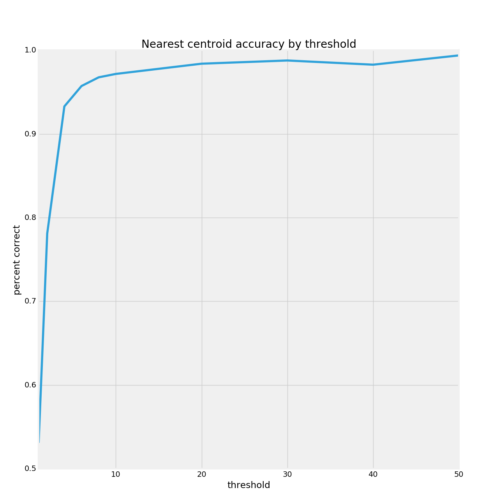
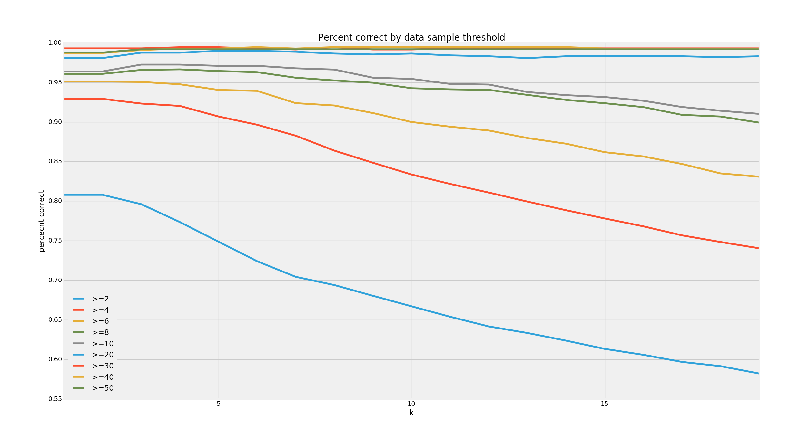
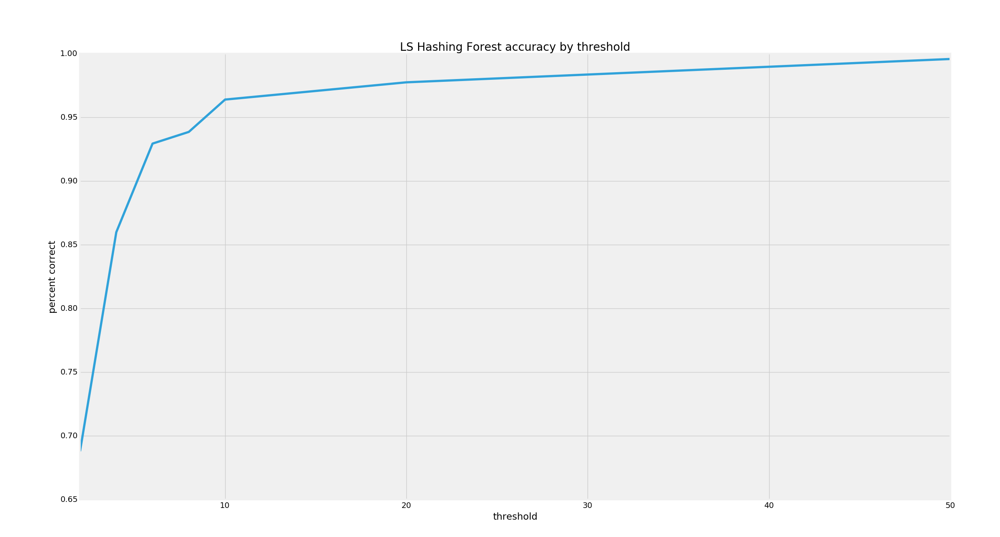
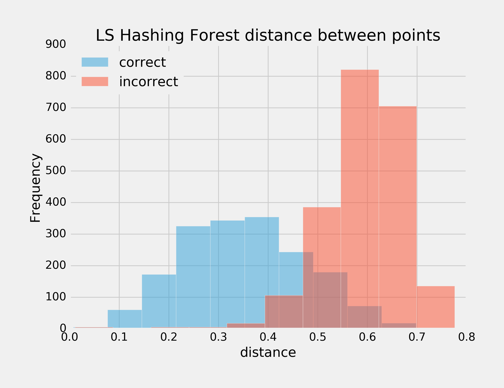

# Living Faces of the Wild: an exploration of models for facial recognition

### Thresholds
We can vary how many vectors we load into the dataset as a kind of hyperparameter for all our models. Basically we can exclude people with fewer than `threshold` vectors to see how much our accuracy goes up. For any neighbors-based supervised model, letting in all the data with a threshold of 1 guarantees that all the people with only one vector will be wrong since their nearest neighbors will always be another person.

### Nearest centroid

As a baseline, we can start with Nearest Centroid. There are no hyperparameters for Nearest Centroid, so this is just a graph showing how well it performs as we exclude more and more of the sparser people we're trying to identify.

That graph took 2 minutes to compute, with the following accuracy scores:
<table>
<tr><td>threshold</td><td>accuracy</td></tr>
<tr><td>1</td><td>0.550191</td></tr>
<tr><td>2</td><td>0.777904</td></tr>
<tr><td>4</td><td>0.931603</td></tr>
<tr><td>6</td><td>0.970807</td></tr>
<tr><td>8</td><td>0.970946</td></tr>
<tr><td>10</td><td>0.977169</td></tr>
<tr><td>20</td><td>0.987254</td></tr>
<tr><td>30</td><td>0.991678</td></tr>
<tr><td>40</td><td>0.987250</td></tr>
<tr><td>50</td><td>0.986577</td></tr>
</table>

### k-nearest neighbors

### Locality-sensitive hashing forest

#### Separating correct and incorrect predictions by distance

