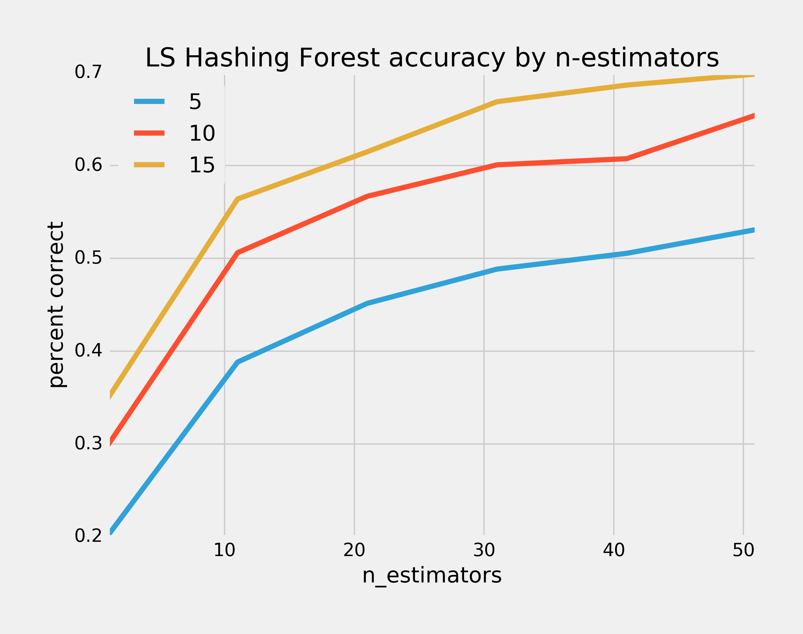

# Living Faces of the Wild: an exploration of models for facial recognition


### Thresholds
We can vary how many vectors we load into the dataset as a kind of hyperparameter for all our models. Basically we can exclude people with fewer than `threshold` vectors to see how much our accuracy goes up. For any neighbors-based supervised model, letting in all the data with a threshold of 1 guarantees that all the people with only one vector will be wrong since their nearest neighbors will always be another person.

```
threshold 	 vectors           people         
 1	          13199	           5736
 2	           9137	           1674
 4	           6712	            607
 6	           5413	            310
 8	           4817	            217
10	           4319	            158
20	           3020	             62
30	           2368	             34
40	           1865	             19
50	           1558	             12
```


### Nearest centroid

As a baseline, we can start with Nearest Centroid. There are no hyperparameters for Nearest Centroid, so this is just a graph showing how well it performs as we exclude more and more of the sparser people we're trying to identify.


That graph took 2 minutes to compute, with the following accuracy scores:
```
threshold 	accuracy       	time (seconds)
 1	         0.5453	            7.0
 2	         0.7753	            1.2
 4	         0.9342	            0.5
 6	         0.9633	            0.3
 8	         0.9689	            0.3
10	         0.9772	            0.2
20	         0.986	            0.2
30	         0.987	            0.3
40	         0.9914	            0.1
50	         0.9958	            0.1
```

### k-nearest neighbors

### Locality-sensitive hashing forest

That graph took hours to compute, mostly because of the n-estimators=15: the median time was 40 minutes for a single run-through of the model, while with n-estimators=10 the median time was 10 minutes. This seems to be the curse of dimensionality rearing its ugly head, so I'll keep n-estimators at or below 10. Surprisingly, though, n-candidates was only modestly correlated with time taken by each model, so it seems we can have a higher value for that hyperparameter.
```
  n_candidates  n_estimators percent_correct time(minutes)
  1             5             0.2011           5.9
  11            5             0.3882           6.7
  21            5             0.4515           7.5
  31            5             0.4884           7.7
  41            5             0.5054           7.7
  51            5             0.5311           7.9
  1             10            0.2985          12.4
  11            10            0.5060           9.8
  21            10            0.5669           9.6
  31            10            0.6008           9.9
  41            10            0.6074          11.0
  51            10            0.6546          12.8
  1             15            0.3490          60.3
  11            15            0.5640          79.8
  21            15            0.6148          40.5
  31            15            0.6688          41.0
  41            15            0.6867           7.9
  51            15            0.6987          24.6
```
These aren't very good results. They all pale in comparison to nearest centroid, which gets better accuracy than all these with a fraction of the time.

### Separating correct and incorrect predictions by distance

